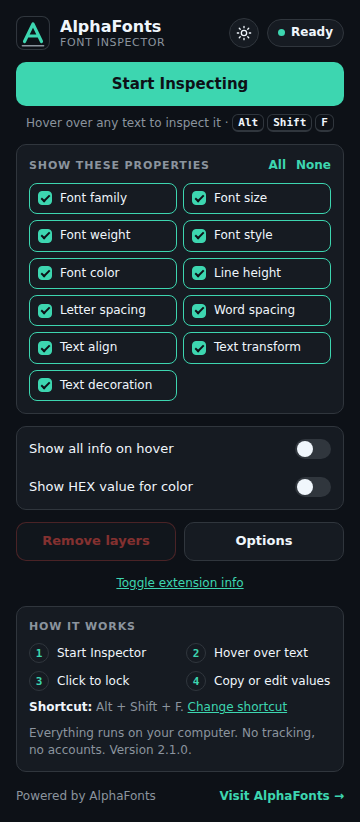
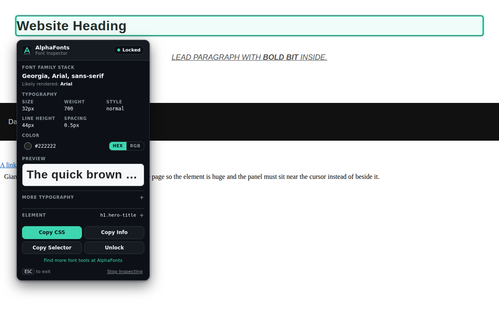

# AlphaFonts Font Inspector

Inspect fonts, typography, and CSS styles on any webpage. Hover over text, click to lock it, and copy the CSS.

Made by [AlphaFonts](https://alphafonts.com). Version 2.0.0 for Google Chrome (Manifest V3).




## Features

- **Inspect webpage fonts** - font family stack, size, weight, style, and more.
- **Inspect typography** - line height, letter spacing, word spacing, alignment, transform, decoration.
- **Inspect colors** - HEX or RGB, with transparency (alpha) always preserved.
- **Copy CSS** - a clean block of the detected typography properties.
- **Copy font information** - a readable plain-text summary.
- **Copy selectors** - a short CSS selector such as `.hero-title` or `#main-heading`.
- **Hover inspection** - a highlight box and a small floating panel follow the text you point at.
- **Click-to-lock** - freeze the panel so you can move the mouse and press buttons.
- **Keyboard shortcut** - `Alt + Shift + F` toggles the inspector.
- **Right-click inspection** - right-click a page, then choose **AlphaFonts > Inspect Font**.
- **Live preview** - a short sample of the text you picked, drawn with its detected typography.
- **Light and dark mode** - use the sun/moon button in the popup, or in the panel once it is locked. Your choice is remembered.

No account, no server, no API keys, no build step.

## Installation

You do not need npm or any tools. Chrome can load the folder directly.

1. Download or clone this project so you have a folder on your computer.
   (On GitHub: **Code > Download ZIP**, then unzip it.)
2. Open Google Chrome.
3. Type `chrome://extensions` in the address bar and press Enter.
4. Turn on **Developer mode** (switch at the top right).
5. Click **Load unpacked**.
6. Select the project folder (the one that contains `manifest.json`).

The AlphaFonts icon now appears in the toolbar. Click the puzzle-piece icon and pin it if you do not see it.

## Usage

1. Open any normal website and click the **AlphaFonts** icon.
2. Click **Start Inspecting**.
3. Hover over text. A highlight and a panel show its typography.
4. Click the text to **lock** the panel. The status changes to "Locked".
5. Press **Copy CSS**, **Copy Info**, or **Copy Selector**. Click the color value to copy the color.
6. Press **Esc** (or **Stop Inspecting**) to leave. Everything is removed from the page.

While inspecting, clicks are used to pick text, so links and buttons on the page do not trigger. They work normally again as soon as you exit.

Other ways to start:

- Press `Alt + Shift + F` (press it again to stop).
- Right-click the page and choose **AlphaFonts > Inspect Font**.

You can change the shortcut at `chrome://extensions/shortcuts`. The popup always shows the shortcut that is currently set.

### Reading the panel

| Section | What it means |
| --- | --- |
| Font family stack | The full `font-family` list from the website's CSS. |
| Likely rendered | A best guess of which font in that list is actually available and used. It is shown only when the browser's checks agree, and it is a hint, not a guarantee. |
| Size, Weight, Style, Line height, Spacing | Computed values for the element. |
| Color | HEX or RGB. Semi-transparent colors always show as `rgba(...)`. |
| Preview | The first ~60 characters of the element's own text, drawn with its detected typography (size capped so the panel stays small). Password fields are never read. Falls back to "The quick brown fox" if the element has no text. |
| More typography | Alignment, transform, decoration, word spacing, and other details. |
| Element | Tag, class, ID, and a generated selector. |

## Limitations

Being honest about what V1 cannot do:

- **Restricted pages.** Chrome does not let any extension run on `chrome://` pages, the Chrome Web Store, `about:` pages, and similar. The popup says "Font inspection isn't available on this page." On `file://` pages, turn on **Allow access to file URLs** for the extension first.
- **Iframes.** Only the main page is inspected. Text inside an iframe (especially from another website, such as embedded videos or payment forms) cannot be inspected and is ignored without errors. When the pointer moves into an iframe, the last highlight may stay visible until you click or move back onto the page.
- **Shadow DOM.** Text inside *open* shadow roots is inspected. Text inside *closed* shadow roots is reported as the host element at best.
- **Rendered font is a guess.** Browsers do not tell pages which font file was drawn. The "likely rendered" line compares text widths to find the first available font. It cannot detect per-character fallbacks, and it stays hidden when the stack starts with a system font.
- **PDFs and some special viewers** (such as Chrome's built-in PDF viewer) do not allow extensions.
- **Wide-gamut colors.** Colors written as `lab()`, `oklch()`, and similar are shown exactly as the browser reports them, without a HEX conversion.

## Privacy

AlphaFonts Font Inspector does all its work locally in your browser.

- It does **not** collect browsing history, page content, or personal information.
- It does **not** send anything to a server. It has no analytics, no tracking, no ads, and loads no remote code.
- The page is only read after **you** start the inspector, and only the style of the element you point at is read.
- The preview text is shown only inside the panel on your screen. It is never saved or sent anywhere.
- Copied text goes only to your clipboard.
- It works offline after installation.
- The only network action is opening <https://alphafonts.com> in a new tab when you click the link yourself.

Permissions used, and why:

| Permission | Why |
| --- | --- |
| `activeTab` | Lets the extension work on the tab you just clicked, used, or right-clicked, only for that moment. No "read all websites" access is requested. |
| `scripting` | Injects the inspector into that tab when you start it. |
| `contextMenus` | Adds the **AlphaFonts > Inspect Font** right-click item. |
| `storage` | Remembers your light/dark choice on your own computer. Nothing else is stored. |

## What's new in 2.0

- The panel preview now shows the text you selected instead of a fixed sentence.
- Light mode with a sun/moon switch (popup and locked panel), remembered between visits.

## Development

The project is plain HTML, CSS, and JavaScript. There is nothing to build.

```
manifest.json            Extension settings (Manifest V3)
src/background/          Service worker: right-click menu, shortcut, injection, messages
src/content/             The inspector that runs inside webpages
  content.js             Start/stop, mouse and keyboard events, lock, copy actions
  typography.js          Reads computed styles, builds CSS/info text, selectors
  panel.js               Highlight box, floating panel, toast (inside a Shadow DOM)
  inspector.css          Styles for the panel
src/popup/               The toolbar popup
src/shared/              Constants and helpers (colors, font stacks, restricted URLs)
src/icons/               Extension icons
tests/                   Unit tests for the pure helpers
```

How the pieces talk (see `src/shared/constants.js` for the message names):

```
popup  --START/STOP/TOGGLE/GET_STATUS-->  background  --same message-->  content script
content script  --INSPECTOR_STARTED/STOPPED/GET_PANEL_STYLES-->  background
```

To change something and try it:

1. Edit the files.
2. Go to `chrome://extensions` and click the reload icon on the AlphaFonts card.
3. Reload the webpage you are testing (old pages keep the previous version of the inspector).

Run the unit tests (needs Node 18 or newer, no packages):

```
node --test tests/utils.test.js
```

## License

MIT - see [LICENSE](LICENSE).
